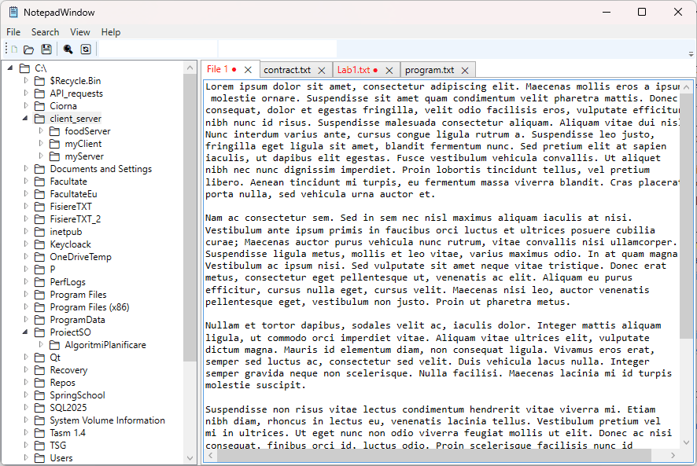

# WPF-Text-Editor

A Notepad++ inspired text editor built with C# and WPF, developed as a learning project to explore MVVM architecture, data binding, and WPF concepts.

---

## Preview



---

## Features

- Multiple tabs with smart auto-numbering - closing File 1 and opening a new tab names it File 1 again, not File 3
- Unsaved changes are marked with a bullet symbol and a red tab title
- Folder explorer with lazy-loaded tree view - directories load their contents only when expanded
- Right-click context menu on directories: New File, Copy Path, Copy Folder, Paste Folder
- Find and Replace with match case, wrap-around and live occurrence counter ("Match 3 of 12")
- Search scope toggleable between current tab and all open tabs simultaneously
- Session restore - all open tabs, including unsaved ones with their content, are restored on next launch
- View mode (Standard / Folder Explorer) is persisted between sessions

---

## Tech Stack

- **Language:** C# (.NET 8)
- **UI Framework:** WPF (Windows Presentation Foundation)
- **Architecture:** MVVM (Model-View-ViewModel)
- **Persistence:** JSON (System.Text.Json)

---

## Architecture
```
Models       - EditorTab, FileSystemItem, AppSettings
ViewModels   - EditorViewModel, TabsViewModel, FileExplorerViewModel, SearchViewModel
Views        - NotepadWindow, FindReplaceWindow, AboutWindow, InputDialog
Services     - FileService, DialogService, SettingsService
Behaviors    - TextBoxHighlightBehavior, TabControlTitleBehavior
Converters   - InverseBoolConverter, BoolToIconConverter
```

---

## How to Run

1. Clone the repository
2. Open `NotepadDemo.sln` in Visual Studio 2022
3. Build and run (F5)

> Requires .NET 8 and Windows.

---

## What I Learned

- MVVM pattern and separation of concerns in a real WPF application
- Data binding: TwoWay, converters, RelativeSource, attached properties
- INotifyPropertyChanged and ObservableCollection for reactive UI updates
- ICommand and RelayCommand with CanExecute for automatic UI state management
- Attached properties and behaviors as an alternative to code-behind
- Lazy loading and recursive tree structures for file system navigation
- Session persistence with JSON serialization

---

## Author

> Project developed by Stoica Anna Maria.
